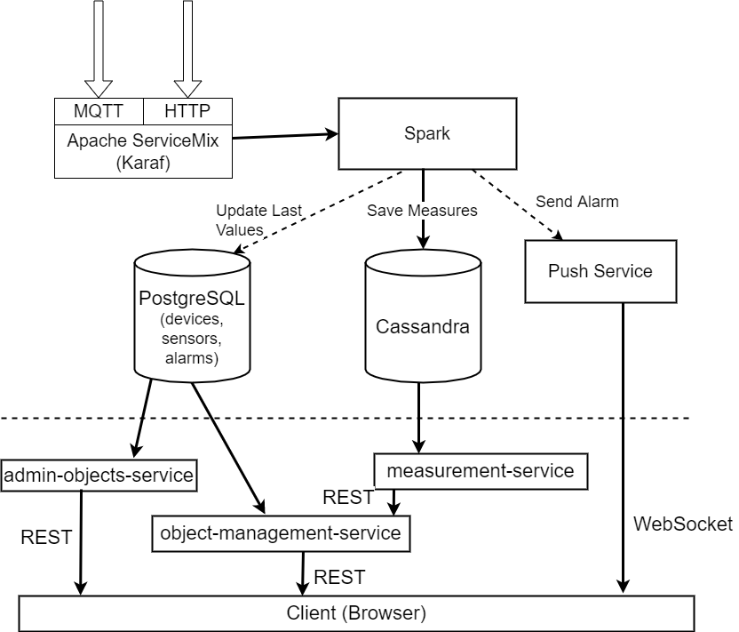
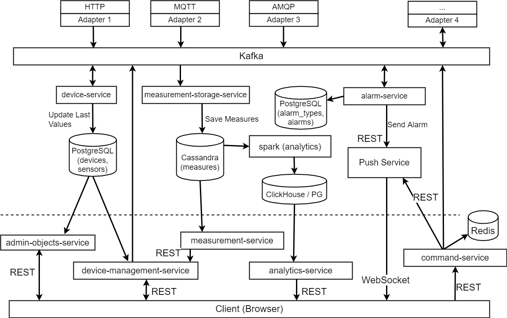
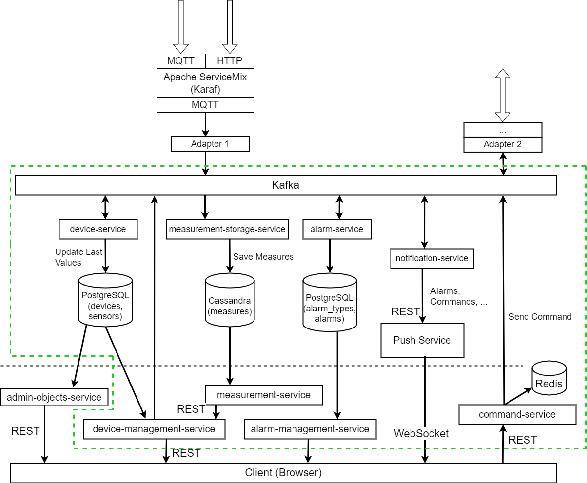
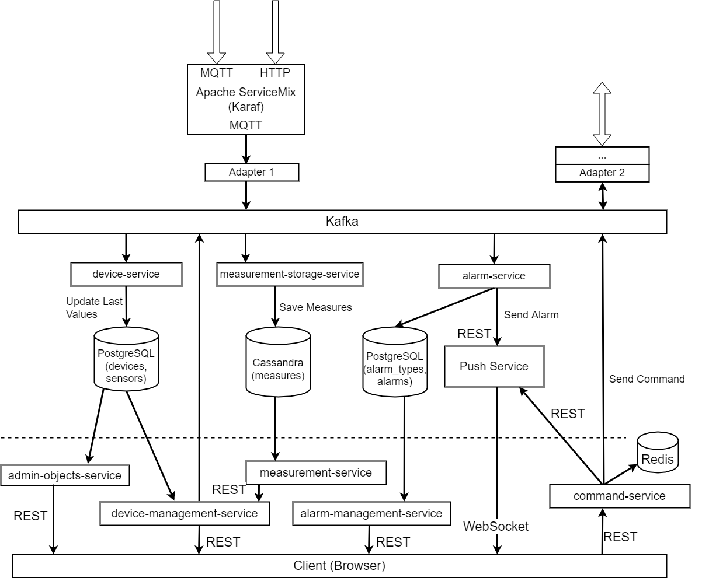

# 1. Исходное решение
Сообщения через адаптеры поступают в **mqtt**-топик, откуда считываются сервисом обработки Spark.

# 2. Планируемые решения

## Список компонентов:
1. **Command Service** - сервис отправки команд на устройство.
2. **Device Service** - сервис для обновления текущих значений параметров устройств в БД с устройствами (PostgreSQL).
3. **Alarm Service** - сервис создания алармов при поступлении новых измерений. Алармы создаются на основании необходимых условий описанных в БД сервиса (PostgreSQL).
4. **Alarm Management Service** - сервис создания типов алармов и сопутствующих необходимых условий, при возникновении которых должен быть создан аларм.
5. **Device Management Service** - сервис управления устройствами. Содержит список устройств и их сенсоров.
   Каждое устройство может содержать несколько сенсоров - каждому из них соответствует один параметр, который он измеряет (temperature, humidity и тд).
   Также сервис хранит список пользователей и групп, которым разрешен доступ к определенным группам устройств.
6. **Notification Service** - сервис уведомлений. Занимается отправкой уведомлений в различные сервисы при возникновении каких-либо событий.
7. **Push Service** - push-сервис. Отвечает за отправку уведомлений пользователям по WebSocket.
8. **Adapter(s)** - сервисы для взаимодействия с устройством. В зависимости от видов взаимодействия и устройства могут как принимать сообщения от устройств,
   так и отправлять сообщения/команды на устройства.

## Цели
1. Перейти от ESB к микросервисам.
2. Добавить функциональность для отправки команд на устройства.

## 1. Полный уход от ESB
1. Вместо ESB используем независимые адаптеры (микросервисы). **MQTT** брокер развертываем отдельно.
2. Вместо единого сервиса обработки сообщений (**Spark**) используем отдельные микросервисы (**Device Service**, **Measurement Storage Service**, **Alarm Service**).
3. Алармы и типы алармов вынесены в отдельную БД (сервиса **Alarm Service**).
4. **Alarm Service** и **Command Service** отправляют уведомления напрямую (REST) в **Push Service**.
5. Добавлен сервис аналитики (**Spark**).
6. Добавлен сервис для отправки команд - **Command Service**.
7. Добавлен адаптер для отправки команд непосредственно на устройство.

## 2. ESB остается. Обработка сообщений/измерений переходит в микросервисы
1. **ESB** с текущими адаптерами остается. Адаптеры **ESB** принимают сообщения из внешних источников и складывают в **mqtt**-топик. 
2. Добавлен адаптер, который забирает сообщения из **mqtt**-топика и отправляет в **Kafka**.
3. Сервис уведомлений (**Notification Service**) подписывается на события сервисов **Alarm Service**, **Command Service**, **Adapter**. 
Отправляет сообщение по REST в (**Push Service**). Также может быть добавлена возможность отправки в другие сервисы (Telegram и тд.).
4. Сервис уведомлений (**Push Service**) принимает полученные сообщения от сервиса уведомлений (**Notification Service**) и отправляет его всем подключенным клиентам по WebSocket.
5. Добавлен сервис для отправки команд - **Command Service**.
6. Добавлен адаптер для отправки команд непосредственно на устройство.

## 3. Вариация второго решения. Сервисы отправляют уведомления по REST напрямую в Push Service.
Отличие от второго варианта:
1. **Alarm Service** и **Command Service** отправляют уведомления напрямую (REST) в **Push Service**.

## Выбор решения
Для реализации выбран **второй** вариант, как наиболее оптимальный на текущем этапе разработки. 
Данный вариант позволяет перевести часть системы на микросервисы, при этом не затрагивая кардинальным образом текущий процесс приемки сообщений и REST-сервисы для GUI.
При необходимости может быть развернута копия текущей системы (но уже с учетом разбиения на микросервисы) для тестирования на реальных данных, достаточно будет подключить адаптер к существующему mqtt-топику на ESB.
В дальнейшем можно будет постепенно перевести прием сообщений (по разным протоколам, от разных устройств и базовых станций) также в отдельные микросервисы.
Сервис уведомлений сделан отдельным от Push Service, что позволит в дальнейшем отправлять сообщения/уведомления в другие внешние системы/сервисы.
В данном решении будет реализована только область выделенная зеленой пунктирной линией. Остальные части схемы не нуждаются в доработке/изменении на данном этапе. 

## Сценарии
### Отправка команды
1. Пользователь отправляет команду для устройства на сервис Command Service.
2. **Command Service** создает событие **command.value_set** (и отправляет в **Kafka**) с текстом команды, а также сохраняет команду в список команд в список отправленных команд в Redis.
3. **Device Management Service** получает событие с командой, проверяет устанавливаемое значение на соответствие допустимым границам, 
обновляет текущее значение параметра в своей БД, после чего создает событие **dm.value_set_approved** в **Kafka**.
4. Адаптер (отвечающий за взаимодействие с устройствами) получает событие **dm.value_set_approved**, отправляет полученную команду непосредственно на устройство,
а также отправляет событие **adapter.value_set_sent** в **Kafka**.
5. **Notification Service** получает событие **adapter.value_set_sent** и отправляет его в **Push Service**.
6. **Push Service** отправляет всем подписанным клиентам по WebSocket уведомление с выполненной командой.

 
### Создание аларма
1. Адаптер получает из внешних источников сообщение с измерением и отправляет в **Kafka** событие **measurement_received** с этим измерением.
2. **Device Service** получает событие **measurement_received** и обновляет текущее значение параметра в БД (PostgreSQL). 
3. **Measurement Storage Service** получает событие **measurement_received** и сохраняет полученное измерение в БД с измерениями (Cassandra).
4. **Alarm Service** получает событие **measurement_received** и при необходимости создает аларм, отправляет событие **alarm.alarm_created** в **Kafka**.
5. **Notification Service** получает событие **alarm.alarm_created** и отправляет его в **Push Service**.
6. **Push Service** отправляет всем подписанным клиентам по WebSocket уведомление с алармом. 

Домашнее задание/проектная работа разработано(-на) для курса [Microservice Architecture](https://otus.ru/lessons/microservice-architecture)
